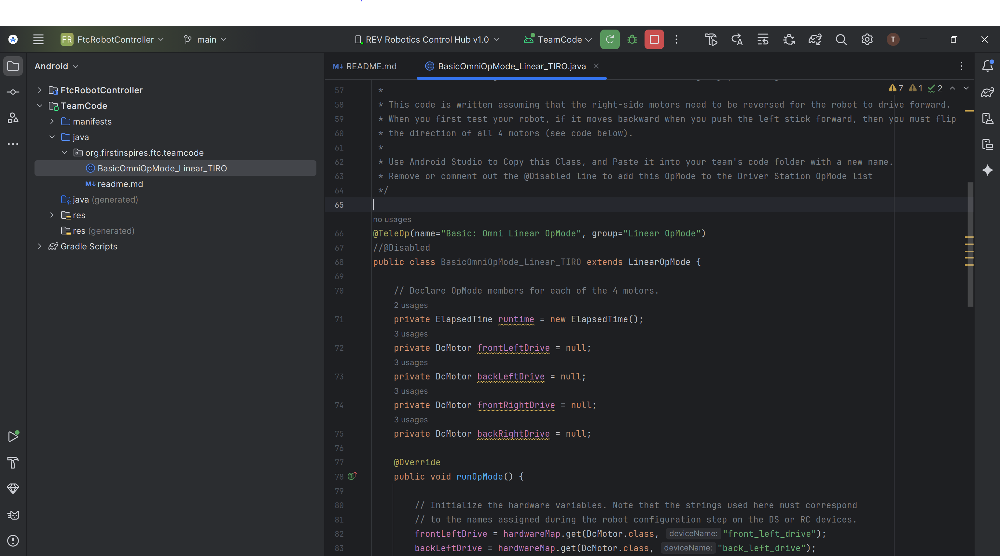

## TIRO FTC
Cloned [FtcRobotController](https://github.com/FIRST-Tech-Challenge/FtcRobotController) Version 11.0 (20250827-105138). Project builds and runs on Rev Robotics Control Hub 1.0v using a wireless connection with Android Studio.

# Control Hub Configuration
XML files are used to configure the robot hardware. These are typically manually configured using the driver hub using the configuration GUI.
To track configurations for multiple robots/development cycles. We will save the zip file using REV Hardware Client. See Screenshot.

TODO: In the future, we will probably create a flow to track the actual XML, that way we can create friendly text diffs().

# Screenshots
